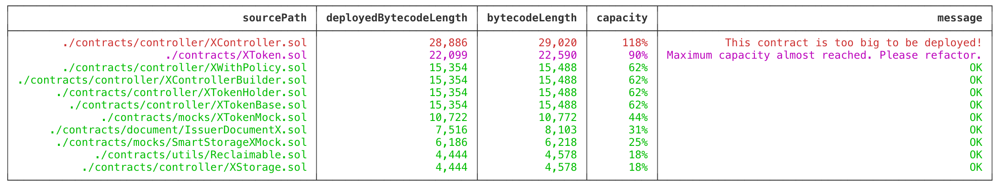

# SCSR: Solidity Contract Size Reporter

This command-line utility calculates the bytecode length
of your solidity contracts and warns you if you are
approaching maximum contract size limit.



## Getting Started

```npm
sudo npm install scsr -g
```

**CLI Arguments**

1. Path to truffle project (or similar) root. `string`
2. Show detailed report. `false` or `true`

**How to Use Solidity Contract Size Reporter?**

Edit your package json and add an entry under `scripts` section.

```json
  "scripts": {
    "compile": "truffle compile && scsr ./ true",
  },
```

and run

```npm
npm run compile
```
